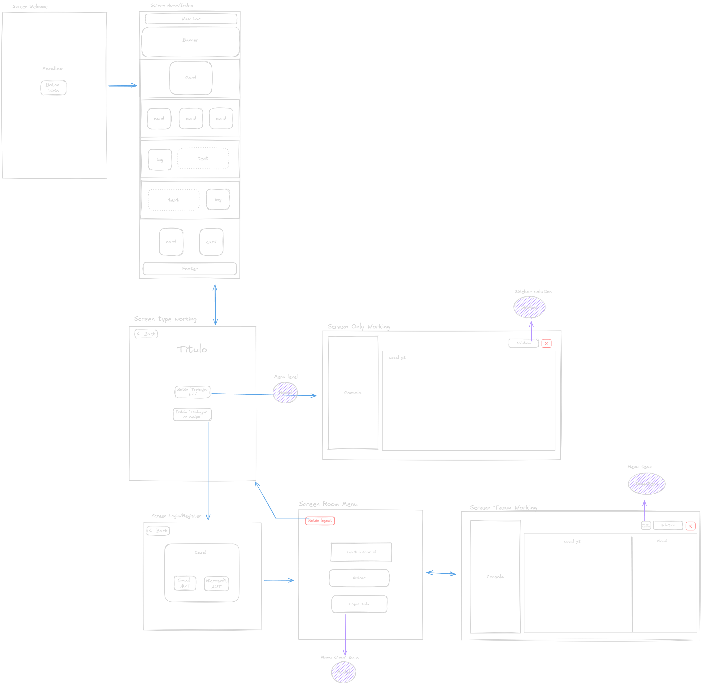
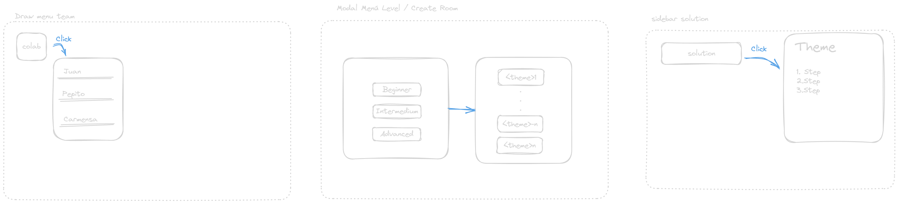
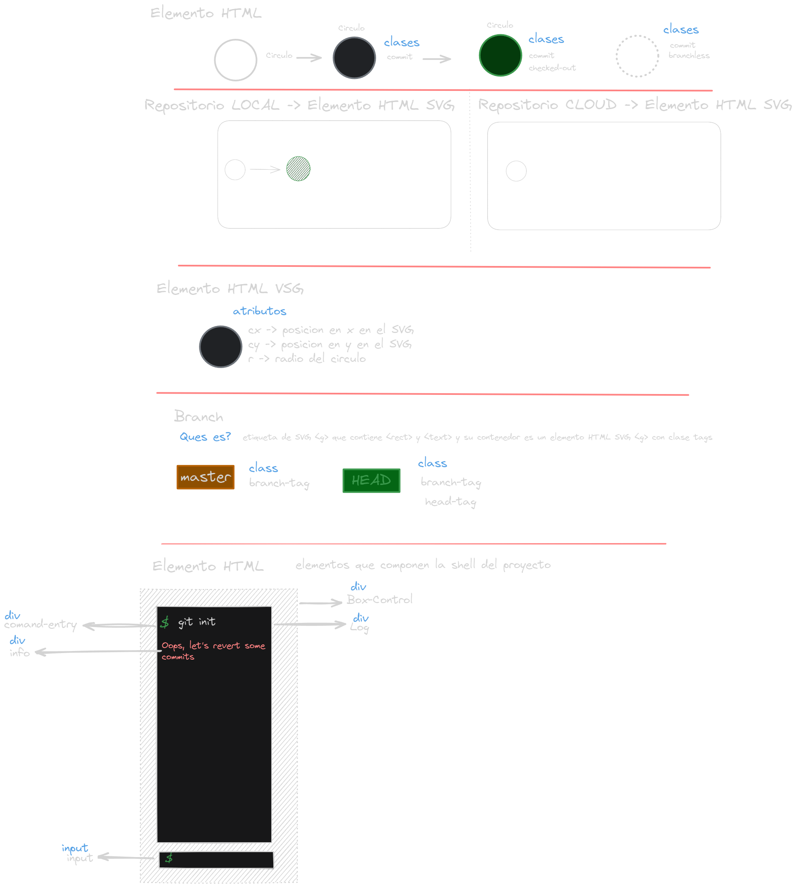
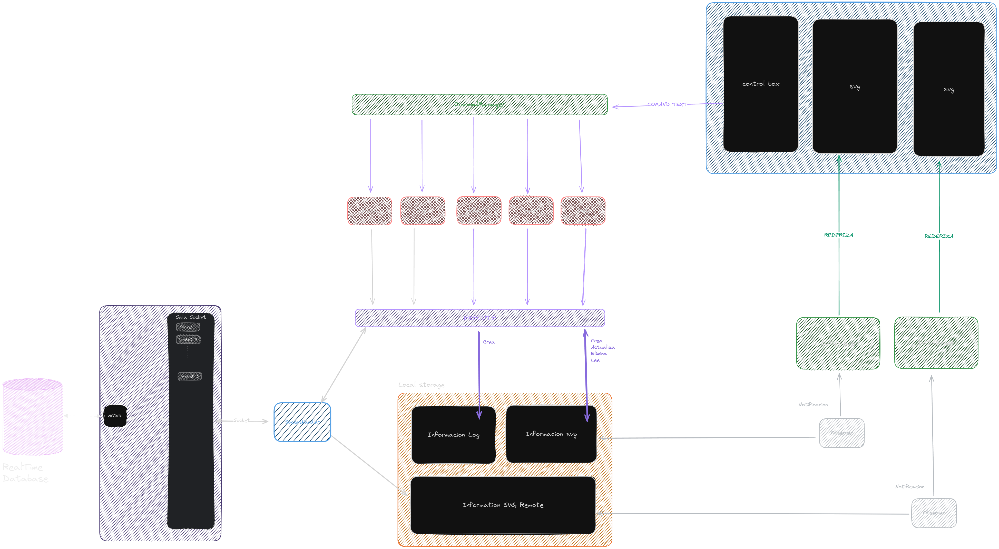
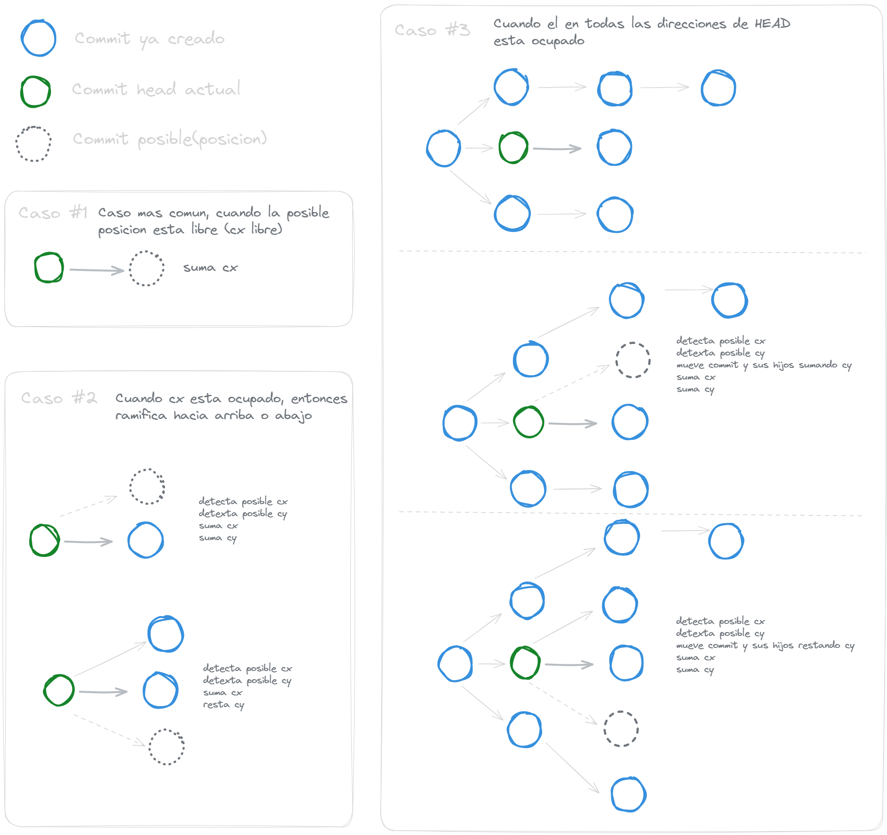
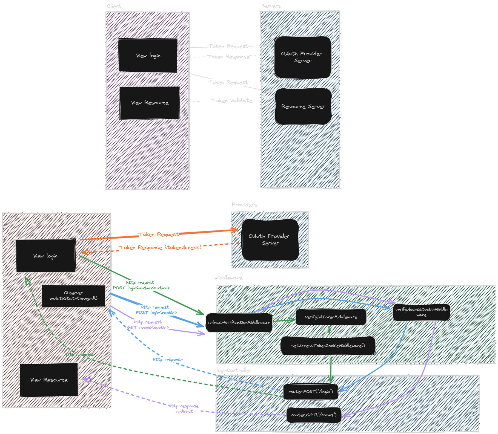
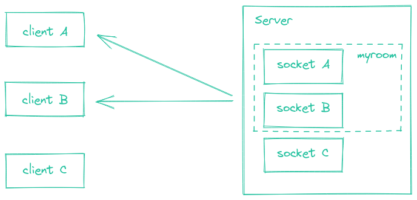

# UD.ProyectoDeGrado.GitCol-Learning

## Indice

1. [Mokaps](#mokaps)
2. [Diseño UI/UX](#diseño-uiux)
3. [Assets](#assets)
4. [Dependencias](#dependencias)
5. [Scripts](#scripts)
6. [Dockers](#dockers)
7. [Comandos de git que soporta la aplicación](#comandos-de-git-que-soporta-la-aplicación)
8. [Commits](#commits)

## Mokaps

### [Mokap Screens](https://excalidraw.com/#room=aa8cb898b51ca15e7332,cJnn7SoDPItVCLnpyTbKOA)



### [Mokap Menus](https://excalidraw.com/#room=799f024d570de905f1eb,IKaxeORRUyZTSAEUkV_AiQ)



### [Mokap Visualizing Git](https://excalidraw.com/#room=977bcce490f934711f98,bvG7SJZBXeIBiKmduDb3ow)

#### Mokap parte 1



#### Mokap parte 2 Local


#### Mokap parte 2 Remote



#### Mokap parte 3


### [Mokap Ramificaciones](https://excalidraw.com/#room=3de5a49605badc01e214,Ez-gRLHN1gGFBWBnyPlZkA)



### [Proceso Auth](https://excalidraw.com/#room=f5e9b3946bfb6efa7de6,sX_7Bvm6NW4Vg4j89S0uJA)



## Diseño UI/UX

### Paleta de colores


## Assets

### Tipografía

- [Virgil](https://virgil.excalidraw.com/)
- [Roboto](https://fonts.google.com/specimen/Roboto?query=Rob)

### Iconos

### Logo

#### JSON PROTOTYPE Ejercicio

Ejercicio

```JSON
{
 "id": 1,
 "name": "",
 "generator": {
  "1": "git commit",
  "2": "..."
 },
 "level": 1,
 "solution": {
  "1": "git commit",
  "2": "..."
 },
 "files":["README.md","style.css","index.html"]
}
```

> [!NOTE]
> Prototype del ejercicio
>
> - challenge: Problema
> - id: identificador del problema
> - name: nombre del problema
> - generator: lista de comando que genera la solución problema
> - level: nivel del problema
> - solution: lista de soluciones de problemas

#### JSON PROTOTYPE Sala

Sala

```JSON
{
    "id": 1,
    "name": "",
    "owner": "",
    "members": {
        "1": "user1",
        "2": "user2"
    },
    "challenge":1,
    "status": "active",
    "chat": {
        "1": {
            "user": "user1",
            "message": "message1"
        },
        "2": {
            "user": "user2",
            "message": "message2"
        }
    },
    "code": {
        "1": {
            "user": "user1",
            "code": "code1"
        },
        "2": {
            "user": "user2",
            "code": "code2"
        }
    }
}
```

> [!NOTE]
> Prototype de la sala
>
> - id: identificador de la sala
> - name: nombre de la sala
> - owner: usuario que creo la sala
> - members: lista de usuarios que pertenecen a la sala
> - challenge: identificador del problema
> - status: estado de la sala
> - chat: lista de mensajes de la sala
> - code: lista de códigos de la sala

#### JSON PROTOTYPE Generator

```JSON
{ [
      {
        "id": "e137e9b",
        "tags": [],
        "message": "first commit",
        "parent": "initial",
        "cx": 50,
        "cy": 330,
        "branchless": false
      },
      {
        "id": "84c98fe",
        "parent": "e137e9b",
        "tags": [
          "master",
          "origin/master"
        ],
        "cx": 140,
        "cy": 330,
        "branchless": false
      }
    ]
}
```

JSON sacado de [Visualizing Git](https://git-school.github.io/visualizing-git/)

## Dependencias

> [!IMPORTANT]
> Comando para instalar las dependencias del proyecto.

```bash
npm install --save-dev @babel/core @babel/cli @babel/preset-env @babel/node &&
npm install express morgan ejs firebase-admin dotenv socket.io swagger-jsdoc swagger-ui-express &&
npm install -g nodemon
```

### Dependencias de desarrollo

- **Nodemon**: Para reiniciar el servidor cuando se detectan cambios en el código, permite agilizar el desarrollo.

```bash
npm install -g nodemon
```

- **Babel**: Para transpilar el código de ES6 a ES5, permite utilizar las nuevas características de JavaScript. Con el fin de que el código sea compatible con navegadores antiguos.

```bash
npm install --save-dev @babel/core @babel/cli @babel/preset-env
```

- **Babel Node**: Para ejecutar el código transpilado por Babel.

```bash
npm install --save-dev @babel/node
```

### Dependencias de producción

- **Express**: Para crear el servidor web.

```bash
npm install express
```

- **Morgan**: Para mostrar en consola las peticiones que llegan al servidor.

```bash
npm install morgan
```

- **EJS**: Para renderizar las vistas.

```bash
npm install ejs
```

- **Firebase-admin**: Para conectar la aplicación con la base de datos de Firebase.

```bash
npm install firebase-admin --save
```

- **dotenv**: Para cargar las variables de entorno.

```bash
npm install --save dotenv
```

- **Socket.io**: Para crear la conexión en tiempo real entre el servidor y el cliente.

```bash
npm install socket.io
```

-**Swagger-jsdoc**: Para documentar la API.

```bash
npm install swagger-jsdoc
```

-**Swagger-ui-express**: Para visualizar la documentación de la API.

```bash
npm install swagger-ui-express
```

## Scripts

- **start**: Ejecuta el servidor en modo producción.

```bash
npm run start
```

## Dockers


Imagene tomada de [Docker](https://docs.docker.com/get-started/overview/)

Para construir la imagen de docker se debe ejecutar el siguiente comando:

```bash
docker build . -t gitcol_learning_image
```

Para ejecutar la imagen de docker se debe ejecutar el siguiente comando:

```bash
docker run -p 3000:8080 -e PORT=8080 --name gitcol_learning_container gitcol_learning_image
```

## Socket

Un socket es un canal de comunicación bidireccional entre un cliente y un servidor. El servidor crea un socket para cada cliente que se conecta. De esta forma, el servidor puede enviar información a un cliente específico. Y el cliente puede enviar información al servidor.

Imagene tomada de [Socket.io](https://socket.io/docs/v4)

### Eventos

Socket.io permite crear eventos personalizados. Los eventos son mensajes que se envían entre el cliente y el servidor. Los eventos se pueden enviar con o sin datos. Pues es un canal de comunicación bidireccional abierta.

Socket.io permite crear salas con las cuales se pueden agrupar sockets. De esta forma, se puede enviar un evento a todos los sockets de una sala específica.


Imagene tomada de [Socket.io](https://socket.io/docs/v4/rooms/)

## Comandos de git que soporta la aplicación

### Modulos que a futuro se implementaran

1. **git init**: Inicializa un repositorio local de git en la carpeta actual.
2. **git config**: Configura el nombre y el correo electrónico del usuario.
    - **git config --global user.name "Nombre"**: Configura el nombre del usuario de forma global.
    - **git config --global user.email "Correo"**: Configura el correo electrónico del usuario de forma global.
    - **git config user.name "Nombre"**: Configura el nombre del usuario de forma local en el repositorio actual.
    - **git config user.email "Correo"**: Configura el correo electrónico del usuario de forma local en el repositorio actual.
    - **git config --list**: Muestra la configuración actual.
    - **git config --global --unset user.name**: Elimina la configuración del nombre del usuario.
    - **git config --global --unset user.email**: Elimina la configuración del correo electrónico del usuario.
3. **git add**: Agrega los archivos al área de preparación.
4. **git rm**: Elimina los archivos del área de preparación.
    - **git rm "NombreArchivo"**: Elimina el archivo del área de preparación.
5. **git commit**: Crea un commit con los archivos del área de preparación y un mensaje.
    - **git commit -m "Mensaje"**: Crea un commit con los archivos del área de preparación y un mensaje.
    - **git commit -am "Mensaje"**: Agrega los archivos al área de preparación y crea un commit con los archivos del área de preparación y un mensaje.
6. **git status**: Muestra el estado actual del repositorio.
7. **git log**: Muestra el historial de commits.
8. **git branch**: Muestra las ramas del repositorio.
    - **git branch "NombreRama"**: Crea una rama con el nombre especificado.
    - **git branch -d "NombreRama"**: Elimina la rama con el nombre especificado.
    - **git branch -m "NombreRama"**: Cambia el nombre de la rama actual.
    - **git branch -a**: Muestra todas las ramas del repositorio.
    - **git branch -l**: Muestra las ramas del repositorio.
    - **git branch -r**: Muestra las ramas remotas del repositorio.
9. **git checkout**: Cambia de rama.
10. **git switch**: Cambia de rama.
11. **git merge**: Fusiona dos ramas.
12. **git push**: Sube los cambios al repositorio remoto.
13. **git pull**: Descarga los cambios del repositorio remoto.
14. **git remote**: Muestra los repositorios remotos.
    - **git remote add "NombreRepositorio" "URLRepositorio"**: Agrega un repositorio remoto.
    - **git remote remove "NombreRepositorio"**: Elimina un repositorio remoto del repositorio local.

> [!NOTE]
> **Idea de implementacion**
> Ya que nosotros no implementamos manejo de archivos la idea es que el comando simule agregar los archivos al área de
>preparación. Con archivos con nombres específicos. Con el fin de que el
>usuario pueda ejecutar los comandos de git.
>
> - **git add .**: Agrega todos los archivos al área de preparación.
> - **git add "NombreArchivo"**: Agrega el archivo al área de preparación.

### Modulos implementados

1. [x] **git init**: Inicializa un repositorio local de git en la carpeta actual.
2. [x] **git commit**: Crea un commit con los archivos del área de preparación y un mensaje.
    - [x] **git commit -m "Mensaje"**: Crea un commit con los archivos del área de preparación y un mensaje.
    - [x] **git commit -am "Mensaje"**: Agrega los archivos al área de preparación y crea un commit con los archivos del área de preparación y un mensaje.
3. [x] **git log**: Muestra el historial de commits.
    - [x] **git log -n number**: Crea una rama con el nombre especificado.
4. [x] **git branch**: Muestra las ramas del repositorio.
    - [x] **git branch "NombreRama"**: Crea una rama con el nombre especificado.
    - [x] **git branch -d "NombreRama"**: Elimina la rama con el nombre especificado.
    - [x] **git branch -m "NombreRama"**: Cambia el nombre de la rama actual.
    - [x] **git branch -a**: Muestra todas las ramas del repositorio.
    - [x] **git branch -l**: Muestra las ramas del repositorio.
    - [x] **git branch -r**: Muestra las ramas remotas del repositorio.
5. [x] **git checkout**: Cambia de rama.
    - [x] **git checkout -b "NombreRama"**: Crea una rama con el nombre especificado y cambia a la rama creada.
    - [x] **git checkout -q "NombreRama"**: Cambia a la rama con el nombre especificado, ocultando los mensajes de cambio de rama.
6. [ ] **git push**: Sube los cambios al repositorio remoto.
7. [ ] **git pull**: Descarga los cambios del repositorio remoto.
8. [ ] **git merge**: Fusiona dos ramas.

> [!NOTE]
> **Modulos MPV**
> Los modulos implementados son los que se consideran necesarios para el funcionamiento de la aplicación. Con el fin de
>que el usuario pueda ejecutar los comandos de git.

## Commits

| Description                          | Type     | Format | Example                                    |
|--------------------------------------|----------|--------|--------------------------------------------|
| **Requirements and Features**        | feat     | `:sparkles:`    | feat: :sparkles: Include new feature       |
| **Change Control**                   | feat     | `:boom:`        | feat: :boom: Service implementation        |
| **Defects and Incidents**            | fix      | `:construction:`| fix: :construction: Mapping is corrected   |
| **Fix bugs**                         | fix      | `:bug:`         | fix: :bug: Mapping order fix               |
| **Immediate correction is required** | fix      | `:ambulance:`   | fix: :ambulance: Fix flow bug              |
| **Phase or sprint implemented**      | feat     | `:package:`     | feat: :package: Feature is included        |
| **Add, update or pass tests**        | test     | `:white_check_mark:` | test: :white_check_mark: New tests added |
| **Add or update documentation**      | docs     | `:memo:`        | docs: :memo: Update doc                    |
| **Add or update UI styles**          | style    | `:lipstick:`    | style: :lipstick: Update UI                |
| **Write bad code needed review**     | refactor | `:poop:`        | refactor: :poop: Fix this please |
| **Remove files**                     | feat     | `:fire:`        | feat: :fire: Remove file                   |
| **Reverting changes**                | revert   | `:rewind:`      | revert: :rewind: I shouldn't do that again |
| **Improving Performance**            | perf     | `:zap:`         | perf: :zap: Optimizing code                |
