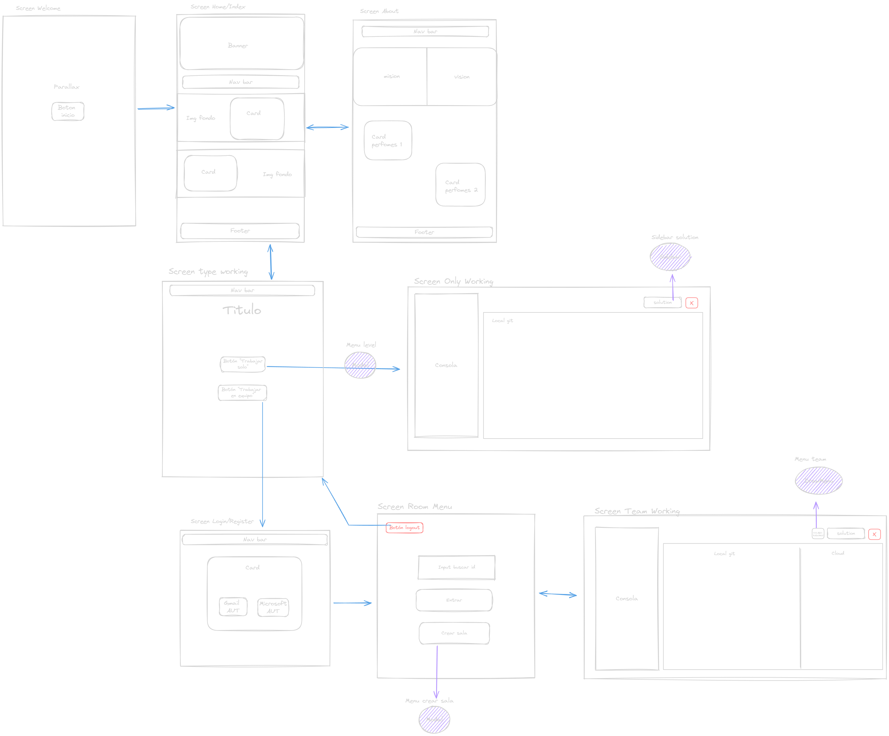
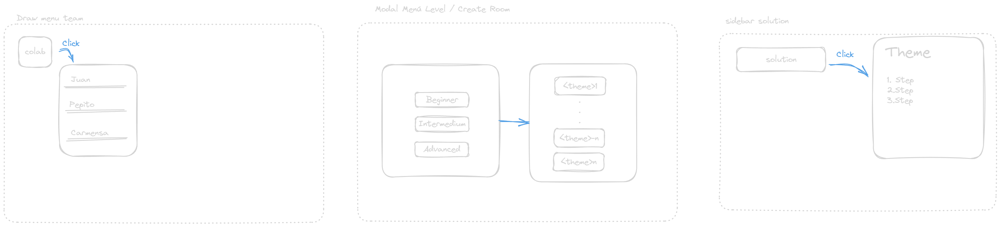
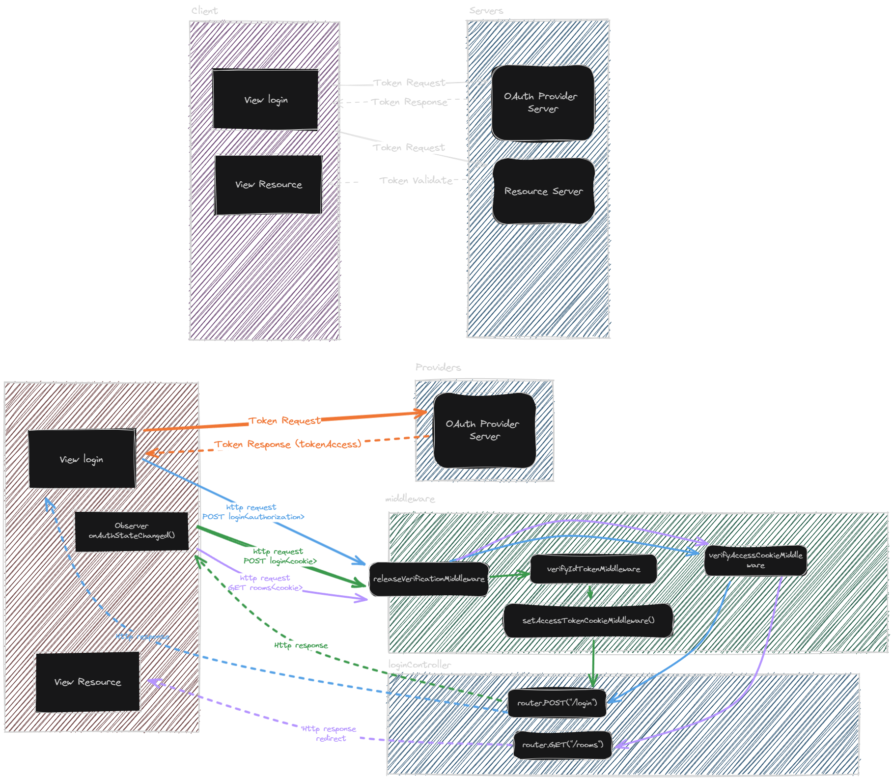

# UD.ProyectoDeGrado.GitCol-Learning

## Indice

1. [Mokaps](#mokaps)
2. [Diseño UI/UX](#diseño-uiux)
3. [Assets](#assets)
4. [Dependencias](#dependencias)
5. [Scripts](#scripts)
6. [Dockers](#dockers)
7. [Arquitectura](#arquitectura)
8. [Comandos de git que soporta la aplicación](#comandos-de-git-que-soporta-la-aplicación)
## Mokaps

### [Mokap Screens](https://excalidraw.com/#room=aa8cb898b51ca15e7332,cJnn7SoDPItVCLnpyTbKOA)



### [Mokap Menus](https://excalidraw.com/#room=799f024d570de905f1eb,IKaxeORRUyZTSAEUkV_AiQ)



### [Mokap Diseño](https://excalidraw.com/#room=f02156652a490656904a,aEEX4YXh5ZaQrA5-SQWIhg)

### [Mokap Auth](https://excalidraw.com/#room=f5e9b3946bfb6efa7de6,sX_7Bvm6NW4Vg4j89S0uJA)



## Diseño UI/UX

### Paleta de colores


## Assets

### Tipografía

- [Virgil](https://virgil.excalidraw.com/)
- [Roboto](https://fonts.google.com/specimen/Roboto?query=Rob)

### Iconos

### Logo

#### JSON PROTOTYPE

Ejercicio

```JSON
{
	"id": 1,
	"name": "",
	"generator": {
		"1": "git commit",
		"2": "..."
	},
	"level": 1,
	"solution": {
		"1": "git commit",
		"2": "..."
	}
}
```

> [!NOTE]
> Prototype del ejercicio
>
> - challenge: Problema
> - id: identificador del problema
> - name: nombre del problema
> - generator: lista de comando que genera la solución problema
> - level: nivel del problema
> - solution: lista de soluciones de problemas

#### JSON PROTOTYPE

Sala

```JSON
{
    "id": 1,
    "name": "",
    "owner": "",
    "members": {
        "1": "user1",
        "2": "user2"
    },
    "challenge":1,
    "status": "active",
    "chat": {
        "1": {
            "user": "user1",
            "message": "message1"
        },
        "2": {
            "user": "user2",
            "message": "message2"
        }
    },
    "code": {
        "1": {
            "user": "user1",
            "code": "code1"
        },
        "2": {
            "user": "user2",
            "code": "code2"
        }
    }
}
```

> [!NOTE]
> Prototype de la sala
>
> - id: identificador de la sala
> - name: nombre de la sala
> - owner: usuario que creo la sala
> - members: lista de usuarios que pertenecen a la sala
> - challenge: identificador del problema
> - status: estado de la sala
> - chat: lista de mensajes de la sala
> - code: lista de códigos de la sala

# Dependencias
> [!IMPORTANT]
> Comando para instalar las dependencias del proyecto.

```bash
npm install --save-dev @babel/core @babel/cli @babel/preset-env @babel/node &&
npm install express morgan ejs firebase-admin dotenv socket.io &&
npm install -g nodemon
```

## Dependencias de desarrollo

- **Nodemon**: Para reiniciar el servidor cuando se detectan cambios en el código, permite agilizar el desarrollo.

```bash
npm install -g nodemon
```

- **Babel**: Para transpilar el código de ES6 a ES5, permite utilizar las nuevas características de JavaScript. Con el fin de que el código sea compatible con navegadores antiguos.

```bash
npm install --save-dev @babel/core @babel/cli @babel/preset-env
```

- **Babel Node**: Para ejecutar el código transpilado por Babel.

```bash
npm install --save-dev @babel/node
```

## Dependencias de producción

- **Express**: Para crear el servidor web.

```bash
npm install express
```

- **Morgan**: Para mostrar en consola las peticiones que llegan al servidor.

```bash
npm install morgan
```

- **EJS**: Para renderizar las vistas.

```bash
npm install ejs
```

- **Firebase-admin**: Para conectar la aplicación con la base de datos de Firebase.

```bash
npm install firebase-admin --save
```

- **dotenv**: Para cargar las variables de entorno.

```bash
npm install --save dotenv
```

- **Socket.io**: Para crear la conexión en tiempo real entre el servidor y el cliente.

```bash
npm install socket.io
```

# Scripts

- **start**: Ejecuta el servidor en modo producción.

```bash
npm run start
```

# Dockers


Para construir la imagen de docker se debe ejecutar el siguiente comando:

```bash
docker build . -t gitcol_learning_image
```

Para ejecutar la imagen de docker se debe ejecutar el siguiente comando:

```bash
docker run -p 3000:8080 -e PORT=8080 --name gitcol_learning_container gitcol_learning_image
```

# Arquitectura

## Estructura

```
└── 📁UD.ProyectoDeGrado.GitCol-Learning
    └── .babelrc
    └── .dockerignore
    └── .env
    └── Dockerfile
    └── 📁documetation
        └── 📁img
            └── MokapAuth.png
            └── MokapsMenus.png
            └── MokapsScreens.png
    └── firebase.json
    └── package-lock.json
    └── package.json
    └── README.md
    └── server.js
    └── 📁src
        └── 📁controller
            └── home-controller.js
            └── login-controller.js
            └── teaser-controller.js
            └── 📁util
                └── login-middleware .js
        └── 📁model
            └── exercise-service.js
            └── firebase-service.js
            └── room-service.js
        └── 📁view
            └── home-screen.ejs
            └── login-screen.ejs
            └── rooms-screen.ejs
            └── teaser-screen.ejs
```
## Estructura de carpetas

- **src**: Contiene el código fuente de la aplicación.

```
└── 📁src
    └── 📁controller
        └── home-controller.js
        └── login-controller.js
        └── teaser-controller.js
        └── 📁util
            └── login-middleware .js
    └── 📁model
        └── exercise-service.js
        └── firebase-service.js
        └── room-service.js
    └── 📁view
        └── home-screen.ejs
        └── login-screen.ejs
        └── rooms-screen.ejs
        └── teaser-screen.ejs
```

- **documetation**: Contiene la documentación del proyecto.

```
└── 📁documetation
    └── 📁img
```

# Comandos de git que soporta la aplicación

1. **git init**: Inicializa un repositorio local de git en la carpeta actual.
2. **git config**: Configura el nombre y el correo electrónico del usuario.
    - **git config --global user.name "Nombre"**: Configura el nombre del usuario de forma global.
    - **git config --global user.email "Correo"**: Configura el correo electrónico del usuario de forma global.
    - **git config user.name "Nombre"**: Configura el nombre del usuario de forma local en el repositorio actual.
    - **git config user.email "Correo"**: Configura el correo electrónico del usuario de forma local en el repositorio actual.
    - **git config --list**: Muestra la configuración actual.
    - **git config --global --unset user.name**: Elimina la configuración del nombre del usuario.
    - **git config --global --unset user.email**: Elimina la configuración del correo electrónico del usuario.
3. **git add**: Agrega los archivos al área de preparación.
> [!NOTE]
> **Idea de implementacion**
> Ya que nosotros no implementamos manejo de archivos la idea es que el comando simule agregar los archivos al área de preparación. Con archivos con nombres específicos. Con el fin de que el usuario pueda ejecutar los comandos de git.
> - **git add .**: Agrega todos los archivos al área de preparación.
> - **git add "NombreArchivo"**: Agrega el archivo al área de preparación.


4. **git rm**: Elimina los archivos del área de preparación.
    - **git rm --cached "NombreArchivo"**: Elimina el archivo del área de preparación.
5. **git restore**: Elimina los archivos del área de preparación.

6. **git commit**: Crea un commit con los archivos del área de preparación.
    - **git commit -m "Mensaje"**: Crea un commit con los archivos del área de preparación y un mensaje.
    - **git commit -am "Mensaje"**: Agrega los archivos al área de preparación y crea un commit con los archivos del área de preparación y un mensaje.
7. **git status**: Muestra el estado actual del repositorio.
8. **git log**: Muestra el historial de commits.
9. **git branch**: Muestra las ramas del repositorio.
    - **git branch "NombreRama"**: Crea una rama con el nombre especificado.
    - **git branch -d "NombreRama"**: Elimina la rama con el nombre especificado.
10. **git checkout**: Cambia de rama.
11. **git switch**: Cambia de rama.
12. **git merge**: Fusiona dos ramas.
13. **git push**: Sube los cambios al repositorio remoto.
14. **git pull**: Descarga los cambios del repositorio remoto.
15. **git clone**: Clona un repositorio remoto.
16. **git remote**: Muestra los repositorios remotos.
    - **git remote add "NombreRepositorio" "URLRepositorio"**: Agrega un repositorio remoto.
    - **git remote remove "NombreRepositorio"**: Elimina un repositorio remoto del repositorio local.


