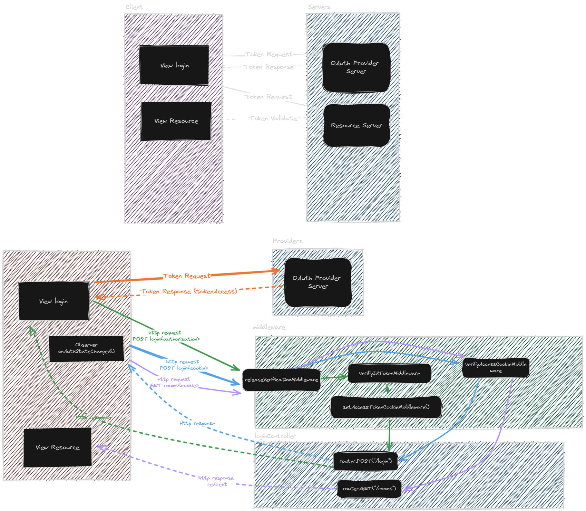

# Autentication Design

This documentation contains the authentication design system for the project. The authentication design system is created using Excalidraw.

## Architecture communication components between the system and the user

This is image shows the general architecture of the system of authentication. It have diferents parts:

At the top of the image have system design simplified.

At the left of the image have the user(frontend) and at the right have the system(backend)

The peticion of the user is sent to the provider by the frontend communicating
with hosting of firebases towards the services of the provider had the frontend using Token and emmiting the peticion to the backend.

### Elements of the system

#### Firebase

Firebase is a platform developed by Google for creating mobile and web applications. It provides a variety of services including authentication, real-time databases, cloud storage, and hosting.

#### Provider

The provider is responsible for providing the authentication service to the user. The provider can be Google or GitHub. They communicate with the firebase services.

#### Middleware

The method middleware that have the backend acknowledge the peticion of the user and send the response to the user depending of the peticion.
