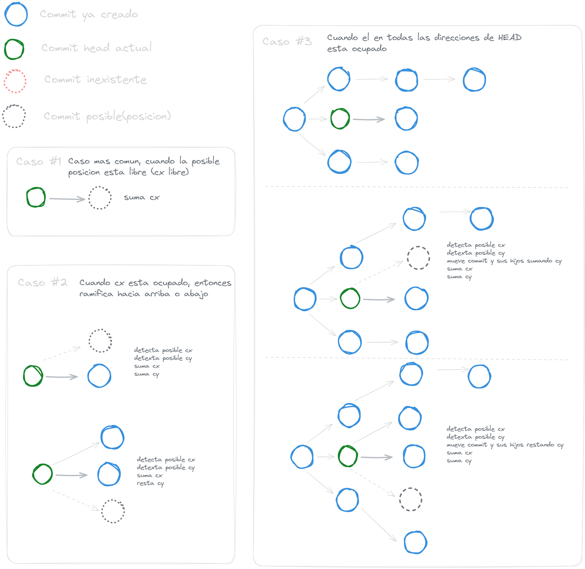
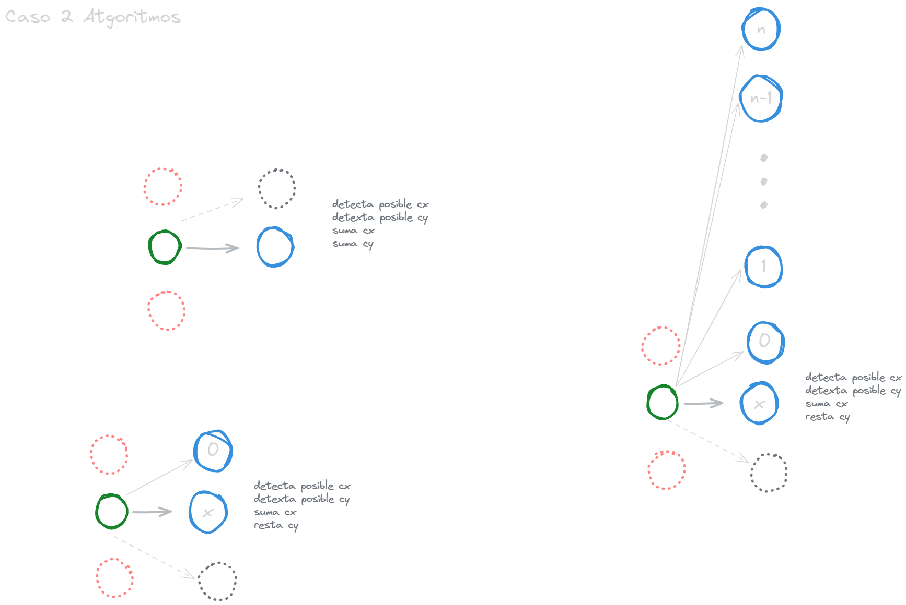
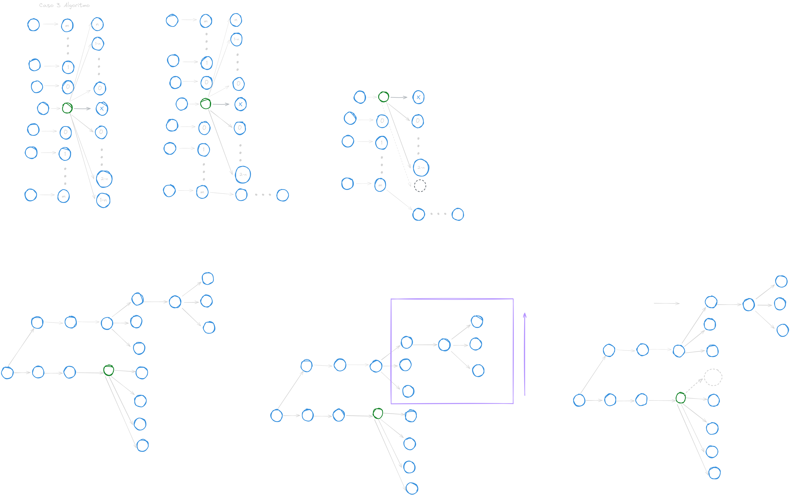

# Branching System

This documentation contains the branching system for the project. The branching system is created using Excalidraw.

## Case 1

The first case is the user selection. The user can select the project and the branch to work on.

Case happens when the user create commit and possible possition of the commit is free. The position normally is the 80 points in 'x' axis to right.

## Case 2

The second case happend when commit not have a first possition free had to be created in the possible position is in the 80 points in 'x' axis to right and 80 points in 'y' axis to down or up.

The priority possition is the 80 points in 'x' axis to right and 80 points in 'y' axis to up. Depending on how many commits are in down or up possition in axis 'y'.

## Case 3

The third case happend when commit not have a first possition free had to be created in the possible position of second case is not possible beacuse the position is occupied and up or down the HEAD is occupied by another commit or branchs then of same second case the priority is of up HEAD but will move to the occupied position to up (80 points to 'y' axis) or down.
