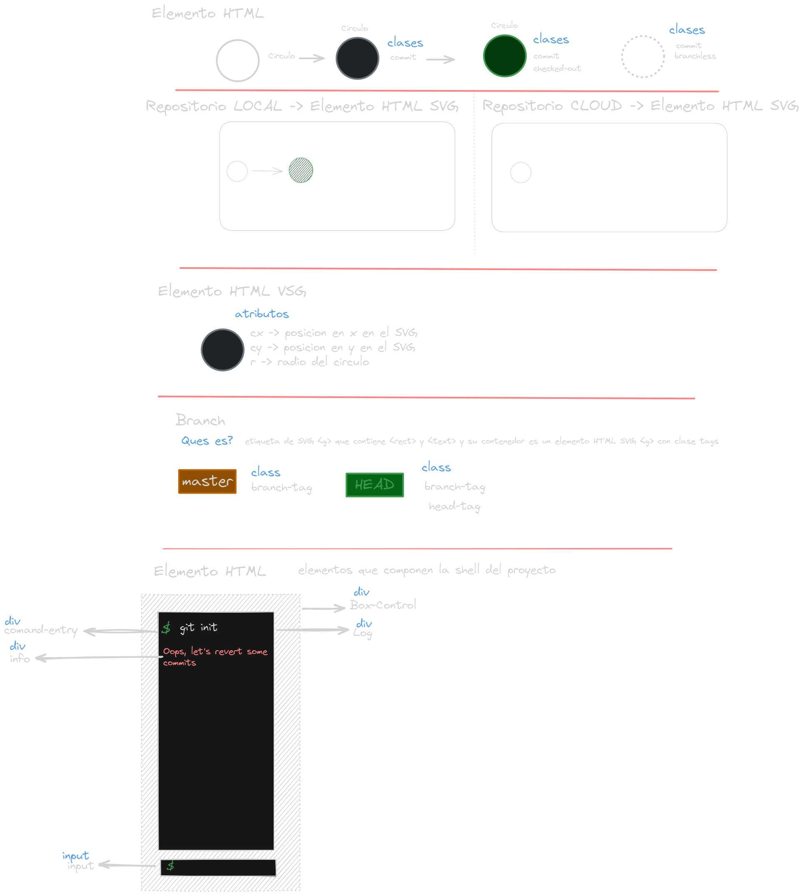

# Communication Design System

This documentation contains the communication design system for the project. The communication design system is created using Excalidraw.

## Architecture Diagram to project "Emulate git"

### Architecture Diagram general

This is image shows the general architecture of the system emulate git. It have three parts:

    1. The first part describes part of style of system.
    2. The second part describes the communication parts of the system.
        - This part have the componets that exist in the system.
    3. The third part describe responsabilities of the parts of the system.

### Architecture Diagram Part 1

This is image describe ideas of the style of the system. It have the following parts:

1. The first part describes the style of the system.
2. The second part describes the colors of the system.
3. The third part describes  maquetation of the system of console.

### Architecture Diagram Part 2 Local

This is image describe ideas of parts of the system and the communication between the parts. It have the following parts:

#### Local Part

- Command Text : This is input text where the user enters the command. Contains the comand and command arguments.
- Command Manager : This part is responsible for managing the commands that the user enters.
- Modules : This part is responsible for emulating the commnad git.
  - Commit
  - Branch
  - Merge
- Execute :  This method is responsible for executing the commands. Modules must have this method.
- Local Storage : This part is responsible for storing the data locally.
  - Information log: This part is responsible for storing the logs of the commands executed.
  - Information SVG: This part is responsible of containt the information who is necessary for the SVG to need render the information.
- Observer : This part is responsible for observing the changes in the local storage.
- DataViewer : This part is responsible for viewing the data stored in the local storage.

##### Other parts

- Control Box : This part is responsible for show messages of the system and give the input service to the user.

- SVG : This part is responsible for show the information of the system in a graphical way.

### Architecture Diagram Part 2 Remote

This is image describe ideas of parts of the system and the communication between the parts. It have the following parts:

#### Remote Part

- SocketHandler : This part is responsible for managing the communication between the local and remote parts of the system. When the user executes a command, the command is sent to the remote part.
  - Pull: Module using to get the information of the remote part.
  - Push: Module using to send the information to the remote part.

- Backend : This part is responsible for managing sockets and the communication, it do agrupation in rooms for the communication.

- Realtime Database :  Services of Firebase for store the information of the system.
-Informacion SVG Remote: This part is responsible of containt the information who is necessary for the SVG to need render the information of the remote part.

##### Other parts remote

- Double SVG: Is necessary for show the information of the local and remote part.
  - Fist SVG:  Is repository of the local part.
  - Second SVG: Is repository of the remote part.

### Architecture Diagram Part 3

This is image describe ideas of the responsabilities of the parts of the system. It have the following parts