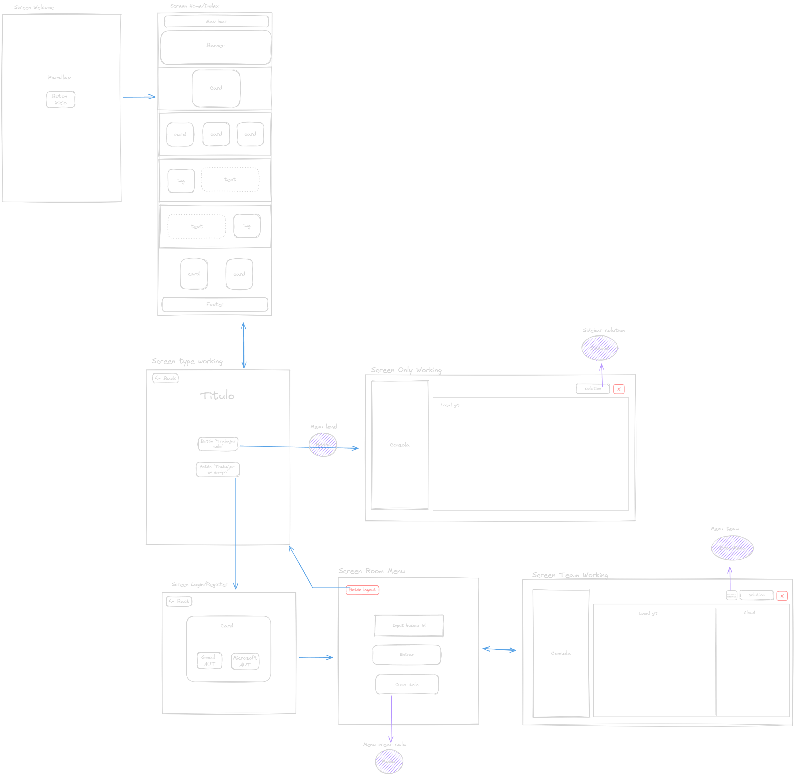
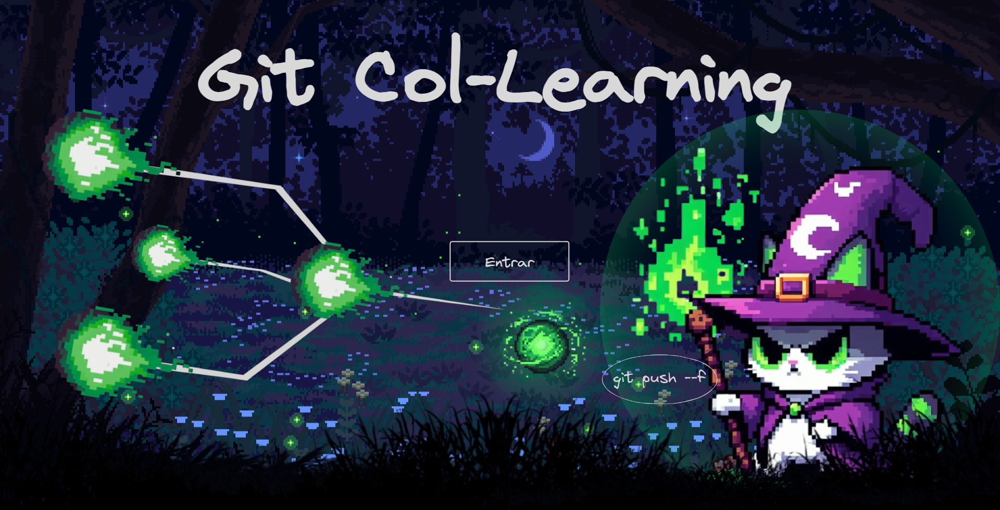

# Prototype Designs

This documentation contains the prototypes mockups for the project. The prototypes are created using Excalidraw.

## Navigation Flow

### Home Page

The home page contains the all the information about the project. It contains the navigation bar, the project name, the project description, the project team members and contact information.

### Selection usability Page

The next page is the seleccion type usage page.
    1. The first option is only user selection.
    2. The second option is collaborative selection.

### Selection autentiacion type

Collaborative selection page contains the following options:
    1. Select login for Google account.
    2. Select login for GitHub account.

### Dialogs config

The dialog boix contains opcion for the configurate the project.

### Dialog Box

## Preview Page

### Teaser

